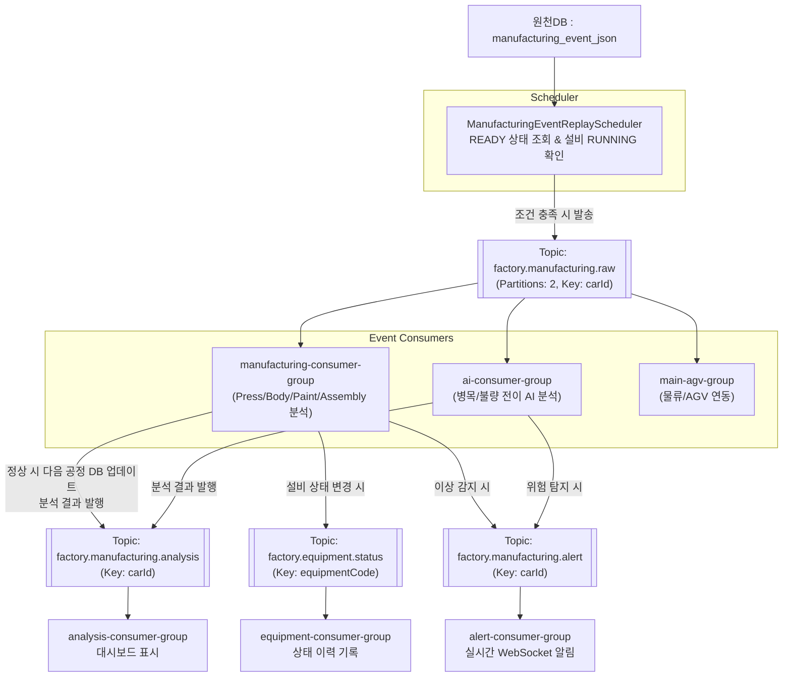

# AIMS - Assembly Service
### AIMS (Auto Intelligence Manufacturing System) - AI 기반 자동차 스마트팩토리 관제 시스템
`assembly-service`는 SK 쉴더스 루키즈 개발 5기 **AI 기반 자동차 스마트팩토리 관제 시스템 AIMS**에서 제조 공정 이벤트를 수집하고, 공정/설비/품질 분석 결과를 대시보드에 제공하는 Spring Boot 기반 백엔드 서비스입니다.

제조 서비스는 프레스·차체·도장·의장 조립 공정에서 발생해 Kafka로 발행된 이벤트를 수집하고, 생산 이벤트와 센서 데이터를 기반으로 이상을 탐지·저장·조회하는 역할을 담당합니다.

## 주요 역할

- 제조 공정 이벤트 수집 및 조회
- 차량별 공정 이동 이력 관리
- 프레스, 차체, 도장, 의장 공정별 분석 결과 관리
- 실시간 병목 분석 결과 제공
- 공정 간 불량 전이 예측 결과 제공
- Kafka 기반 제조 이벤트 스트리밍 연동
- Redis 기반 실시간 대시보드 캐시 연동

## ✨ 제조 주요 기능

### 공정별 이상 탐지 분석 (ISO 통계적 공정관리 적용)


**ISO 표준 문서 및 통계적 공정관리(SPC) 원칙**에 따라 설비별 정상 데이터의 평균(μ)과 표준편차(σ)를 기반으로 동적 임계값을 생성하여 이상을 탐지합니다. (2σ 이내 정상, 2~3σ 경고, 3σ 초과 위험)

### 1. 프레스 공정 (Press)


- **적용 레퍼런스:** `ISO 22400`(제조 KPI), `ISO 7870`(관리도), `ISO 20958`(모터 전류 상태감시)
- **사이클 시간 (`cycleTimeSec`) 및 지연시간 (`timestampDelaySec`):**
  - 차종, 금형, 작업별 평균 사이클 시간 및 지연시간에 대해 평균+2σ 이내면 `NORMAL`, 2~3σ는 `WARNING`, 3σ 초과는 `CRITICAL`로 판정합니다.
- **전류 RMS (`current.rmsAmpere`):**
  - 모터 및 운전 단계(타격/복귀/대기)별 정상 전류의 평균과 표준편차를 기준으로 평가합니다. 제조사 과부하 한계를 초과하거나 3σ를 벗어나면 `CRITICAL`입니다.
- **생산 카운트 (`countIncreaseYn`):** `true` 시 정상, 데이터 누락(`null`) 시 경고, `false` 시 위험.
- **설비 상태 (`operationStatus`):** `RUNNING` 정상, `WARNING` 경고, `STOPPED/FAULT` 위험.

### 2. 차체 공정 (Body)


- **적용 레퍼런스:** `ISO 13373`(진동 센서 측정/분석), `ISO 20816`(기계 진동 상태평가), `ISO 7870`
- **로봇 진동 점수 (`vibrationScore`) 및 주파수 피크 (`frequencyBands`):**
  - 로봇 번호, 작업 프로그램, 속도, 페이로드 조건에 따라 정상 평균과 표준편차를 도출합니다. 조건별 평균+2σ 이하 `NORMAL`, 2~3σ `WARNING`, 3σ 초과 `CRITICAL`. (각 주파수 대역별로 별도 임계치 적용)
- **로봇 상태 (`robotMotionStatus`):** `NORMAL` 정상, `WARNING` 경고, `ABNORMAL` 또는 `COLLISION_RISK` 위험.
- **운전 모드 (`robotOperationMode`):** 생산 중 `AUTO` 정상. 계획 없는 `MANUAL/STOPPED` 위험.

### 3. 도장 공정 (Paint)


- **적용 레퍼런스:** `ISO 4628-1`(도막 결함 평가), `ISO 2808`(도막 두께 측정)
- **표면 품질 점수 (`surfaceQualityScore`):** ISO 결함 등급을 점수로 환산. 80점 이상 정상, 60~80점 경고, 60점 미만 위험.
- **도막 두께 (`thicknessValue`):** 목표치 115μm (90~120μm 범위 내 정상). 80μm 미만 또는 130μm 초과 시 위험.
- **불량 점수 (`defectScore`):** 0.4 미만 정상, 0.4~0.6 경고, 0.6 이상 위험 (`visionLabel`이 정상이어도 점수에 따라 경고 발송).
- **온도 편차 (`thermalStdTemp`):** 오븐 온도 균일도 기준에 따라 2℃ 미만 정상, 2~5℃ 경고, 5℃ 이상 위험.

### 4. 의장 공정 (Assembly)


- **작업/조립 순서 오류 (`sequenceErrorCount`):** 실제 작업 순서(`actualSequence`)가 기준 순서(`expectedSequence`)와 불일치할 경우 위험(`CRITICAL`) 판정.
- **부품 누락 (`missingPartCount`) 및 체결 오류 (`fasteningErrorCount`):** 1건이라도 발생 시 위험 판정.

### 제조 병목 탐지

Bosch Production Line Performance Dataset의 Station 통과 시간, 공정 처리 시간, 대기 시간을 기반으로 병목 공정을 탐지합니다.

판단 예시:
- 평균 처리 시간 대비 30% 이상 증가
- 특정 Station 체류 시간 급증
- 생산 대기열 증가
- 공정별 지연 위험도 증가

### 공정 간 불량 전이 예측

공정별 센서 데이터, 공정 이동 이력, 품질 검사 결과를 기반으로 특정 공정의 이상이 후속 공정의 불량으로 이어질 가능성을 예측합니다.

예시:
- 차체 공정 이상이 도장 공정 불량으로 전이될 확률
- 도장 공정 불량 위험도
- 주요 원인 Station 및 Sensor Feature
- 위험도 등급: `LOW`, `MEDIUM`, `HIGH`

## 📊 활용 데이터셋

프로젝트의 AI 분석 신뢰도와 공정 모의(Simulation)를 위해 다음의 산업용 오픈 데이터셋을 활용합니다.

### 1. [Ford Engine Dataset](https://www.kamp-ai.kr/aidataDetail?DATASET_SEQ=2)
엔진 진동 시계열 데이터를 바탕으로 정상(`1`)과 이상(`-1`)을 분류하는 KAMP 예지보전 데이터셋입니다.
- **활용 공정:** 프레스, 차체 공정
- **주요 활용도:** 로봇 암 및 프레스 설비 진동 이상 탐지 패턴 적용

### 2. [소성가공 자원최적화 AI 데이터셋](https://www.kamp-ai.kr/aidataDetail?DATASET_SEQ=46)
프레스 유압 모터 및 로봇의 전류(`RMS[A]`)와 가속도(`Acceleration[g]`) 시계열 데이터가 포함되어 있습니다.
- **활용 공정:** 프레스 공정
- **주요 활용도:** 전류 피크(Peak) 탐지, 모터 과부하 및 설비 비정상 정지 상태 감지

### 3. [머신비전 AI 데이터셋 (열화상 품질 검사)](https://www.kamp-ai.kr/aidataDetail?AI_SEARCH=%EB%A8%B8%EC%8B%A0%EB%B9%84%EC%A0%84+AI+%EB%8D%B0%EC%9D%B4%ED%84%B0%EC%85%8B&page=1&DATASET_SEQ=6&DISPLAY_MODE_SEL=CARD&EQUIP_SEL=&GUBUN_SEL=&FILE_TYPE_SEL=&WDATE_SEL=)
제품 표면의 열화상 센서 데이터와 정상(`0`), 불량(`1`)이 라벨링된 품질 검사 데이터셋입니다.
- **활용 공정:** 도장 공정
- **주요 활용도:** 도장 표면 온도 편차 분석 및 비전 기반 품질 불량 탐지 이벤트 생성

### 4. [Bosch Production Line Performance Dataset](https://www.kaggle.com/competitions/bosch-production-line-performance/overview)
Kaggle에서 제공하는 대규모 제조 라인 성능 데이터셋으로, 공정 센서값, 시간 정보, 상태 정보 등을 포함합니다.
- **활용 공정:** 통합 관제 (병목 및 품질 분석)
- **주요 활용도:**
  - Station 체류 시간 등을 분석하여 **제조 병목 공정 탐지**
  - 특정 공정의 센서 데이터가 후속 공정에 미치는 영향을 분석해 **공정 간 불량 전이 예측**


## 🛠 전체 데이터 기능 흐름


## 🚀 이벤트 JSON 및 Kafka 처리 (상세 설계)

### 1. 원천 데이터베이스 설계

DB는 `sampledb`(샘플 원천 데이터)와 `maindb`(분석 결과 데이터)로 분리됩니다. 원천 데이터 흐름 제어는 다음 3개의 주요 테이블을 통해 관리됩니다.

- **`car_master`**: 차량 기준 정보 및 상태 관리 (`WAITING`, `RUNNING`, `HOLD`, `DEFECT`, `COMPLETED`)
- **`equipment`**: 공정별 설비 정보 및 상태 (`RUNNING`, `IDLE`, `STOPPED`, `FAULT`, `MAINTENANCE`)
- **`manufacturing_event_json`**: 10만 건 이상의 공정/센서/품질 원천 이벤트

**제조 이벤트 흐름 제어 원칙:**
차량 1대당 4개 공정(PRESS, BODY, PAINT, ASSEMBLY)의 이벤트가 존재하지만, **최초에는 PRESS만 `READY` 상태**입니다.
정상적으로 공정이 완료된 경우에만 다음 공정 row의 상태를 `READY`로 변경하여 스케줄러가 가져갈 수 있게 합니다.

*상태값 의미:*
- `dispatch_status`: `PENDING`(대기), `READY`(발행 가능), `SENT`(발행 완료), `BLOCKED`(설비 고장 대기), `SKIPPED`(진행 불가), `FAILED`
- `analysis_status`: `NOT_ANALYZED`, `NORMAL`, `ABNORMAL`

### 2. Kafka Topic 구성

제조 이벤트, 분석 결과, 설비 상태, 알림을 분리하기 위해 4개의 Topic을 운영합니다. 모든 Topic은 2개의 파티션으로 구성됩니다.

| Topic | 역할 | Producer | Consumer Group | Message Key |
| --- | --- | --- | --- | --- |
| `factory.manufacturing.raw` | 원천 제조 이벤트 전달 | Scheduler | `manufacturing-consumer-group`, `ai-consumer-group`, `main-agv-group` | `carId` |
| `factory.manufacturing.analysis` | 공정/AI 분석 결과 전달 | Manufacturing / AI Service | `analysis-consumer-group` | `carId` |
| `factory.equipment.status` | 설비 상태 변경 이벤트 전달 | Equipment Service 등 | `equipment-consumer-group` | `equipmentCode` |
| `factory.manufacturing.alert` | 이상/위험 알림 이벤트 전달 | 각 도메인 Service | `alert-consumer-group` | `carId` |

* `carId`를 Key로 사용함으로써 동일 차량의 이벤트 순서를 파티션 레벨에서 보장합니다.

### 3. Kafka 제조 이벤트 파이프라인 흐름도



### 4. Scheduler 및 Consumer 상세 로직

**1) Scheduler 로직**
- `manufacturing_event_json`에서 `dispatch_status = 'READY'`인 이벤트를 조회합니다.
- 해당 설비의 현재 `operation_status`가 `RUNNING`인지 확인합니다.
- 정상이면 `factory.manufacturing.raw`로 이벤트를 발행하고 `is_sent=1`, `dispatch_status='SENT'`로 업데이트합니다.
- 설비가 고장(`FAULT`, `STOPPED`)이면 `BLOCKED` 처리하고 발행하지 않습니다.

**2) Consumer (제조 공정 로직)**
- `manufacturing-consumer-group`은 이벤트를 소비하고 `processCode`에 따라 분기합니다. (예: `PRESS` -> `PressAnalysisService`)
- 분석 결과가 **정상(NORMAL)**인 경우: 현재 이벤트를 `NORMAL`로 기록하고, **해당 차량의 다음 공정 이벤트를 `READY`로 업데이트**합니다.
- 분석 결과가 **이상(ABNORMAL)**인 경우: 다음 공정을 `READY`로 바꾸지 않고 해당 차량을 `HOLD` 또는 `DEFECT` 상태로 전환합니다.
- 설비 상태 변화나 이상이 발견되면 각각 설비 토픽 및 알림 토픽으로 후속 이벤트를 비동기 발행합니다.

## 🔧 기술 스택

<p align="left">
  
  
  
  
  
  
  
  
  
  
  
  
  
</p>

## 로컬 실행 및 테스트

```bash
# 로컬 서버 실행
./gradlew bootRun

# 단위 및 통합 테스트 실행
./gradlew test
```

- Swagger UI: `http://localhost:8082/swagger-ui/index.html`
