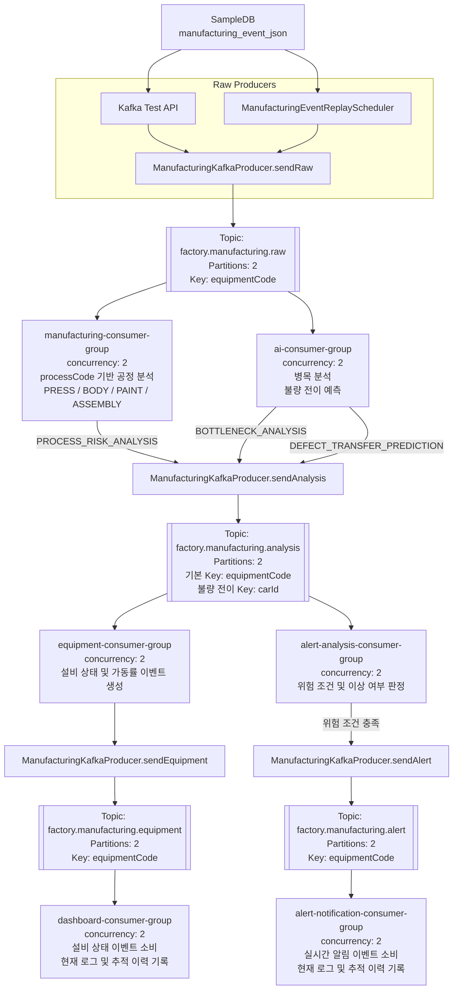

# Assembly Service

`assembly-service`는 모빌리티 스마트팩토리 관제 시스템에서 제조 공정 이벤트를 수집하고, 공정/설비/품질 분석 결과를 대시보드에 제공하는 Spring Boot 기반 백엔드 서비스입니다.

이 서비스는 프레스, 차체, 도장, 의장 조립 공정에서 발생하는 생산 이벤트와 센서 데이터를 기반으로 제조 병목 탐지, 공정별 이상 분석, 불량 전이 예측 결과를 생성하거나 조회하는 역할을 담당합니다.

## 주요 역할

- 제조 공정 이벤트 수집 및 조회
- 차량별 공정 이동 이력 관리
- 프레스, 차체, 도장, 의장 공정별 분석 결과 관리
  - 프레스 이상 정지 탐지
  - 차체 로봇 이상 동작 및 충돌 위험 탐지
  - 도장 품질 이상 탐지
  - 의장 조립 순서 오류 탐지
- 실시간 병목 분석 결과 제공
- 공정 간 불량 전이 예측 결과 제공
- Kafka 기반 제조 이벤트 스트리밍 연동
- Redis 기반 실시간 대시보드 캐시 연동
- OpenSearch 기반 제조 이벤트/분석 로그 검색 연동

## MVP 기능

### 제조 병목 탐지

Bosch Production Line Performance Dataset의 Station 통과 시간, 공정 처리 시간, 대기 시간을 기반으로 병목 공정을 탐지합니다.

판단 예시:

- 평균 처리 시간 대비 30% 이상 증가
- 특정 Station 체류 시간 급증
- 생산 대기열 증가
- 공정별 지연 위험도 증가

### 공정 간 불량 전이 예측

공정별 센서 데이터, 공정 이동 이력, 품질 검사 결과를 기반으로 특정 공정의 이상이 후속 공정의 불량으로 이어질 가능성을 예측합니다.

예시:

- 차체 공정 이상이 도장 공정 불량으로 전이될 확률
- 도장 공정 불량 위험도
- 주요 원인 Station 및 Sensor Feature
- 위험도 등급: `LOW`, `MEDIUM`, `HIGH`

### 공정별 분석

- 프레스: 전류 RMS, 진동, 생산 카운트, Timestamp 지연 기반 이상 정지 탐지
- 차체: 로봇 전류, 진동, 충돌 위험, 로봇 동작 이상 탐지
- 도장: 열화상 온도, 표면 품질 점수, 불량률 기반 품질 이상 탐지
- 의장: 조립 순서 오류, 부품 누락, 체결 오류 탐지

### 알림

공정별 분석 결과, 병목 분석 결과, 불량 전이 예측 결과에서 이상이 탐지되면 알림 데이터를 생성하고 프론트엔드 알림 화면에서 조회할 수 있도록 구성합니다.

## 활용 데이터셋

### Ford Engine Dataset

엔진 진동 시계열 데이터 기반 정상/이상 분류 데이터셋입니다.

- 데이터 형태: 시계열
- 샘플 길이: 500
- 라벨: `1` 정상, `-1` 이상
- 활용: 프레스/로봇 진동 이상 탐지, 예지보전

### 소성가공 자원최적화 AI 데이터셋

프레스 유압모터 및 로봇 전류 데이터를 포함합니다.

- 주요 컬럼: `Time_s[s]`, `RMS[A]`, `Acceleration[g]`
- 활용: 전류 Peak 탐지, 모터 과부하 탐지, 설비 정지 상태 분석

### 머신비전 AI 데이터셋

열화상 기반 품질 검사 데이터셋입니다.

- 데이터: 센서/전류 시계열 CSV, 라벨 JSON
- 라벨: `0` 정상, `1` 이상/불량
- 활용: 도장 품질 이상 탐지, 품질 검사 이벤트 생성

### Bosch Production Line Performance Dataset

대규모 제조 공정 데이터셋입니다.

- Numeric: 센서/측정값
- Date: 공정 시간 정보
- Categorical: 공정 상태 정보
- Response: 정상/불량 라벨
- 활용: 제조 병목 탐지, 공정 간 불량 전이 예측, 생산라인 통합 분석

## DB 구조

DB는 `sampledb`와 `maindb`로 분리합니다. 두 DB는 같은 MySQL 서버와 포트를 사용하지만 schema를 분리합니다.

### sampledb

관제 시스템으로 유입되는 샘플 원천 데이터를 저장합니다.

주요 테이블:

- `car_master`: 차량 기준 정보
- `equipment`: 샘플 설비 정보
- `manufacturing_event_json`: 공정/센서/품질 공통 이벤트

### maindb

대시보드 조회와 분석 결과 데이터를 저장합니다.

주요 테이블:

- `press_analysis_result`: 프레스 공정 분석 결과
- `body_analysis_result`: 차체 공정 분석 결과
- `paint_analysis_result`: 도장 공정 분석 결과
- `assembly_analysis_result`: 의장 공정 분석 결과
- `bottleneck_analysis_result`: 병목 분석 결과
- `defect_transfer_prediction_result`: 불량 전이 예측 결과
- `notification`: 실시간 알림

### DB 간 참조 방식

`sampledb`와 `maindb` 사이에는 물리 FK를 사용하지 않고 논리 참조를 사용합니다.

예시:

- `maindb.body_analysis_result.manufacturing_event_id`
- `sampledb.manufacturing_event.id`
- `sampledb.robot_arm_vibration.manufacturing_event_id`

## 인프라 연동

### Kafka

SampleDB의 제조 이벤트를 재생하고 공정 분석, AI 분석, 설비 상태, 위험 알림을 비동기로 전달하는 이벤트 백본으로 사용합니다.

현재 사용하는 Topic은 다음과 같으며 모두 Partition 2개로 구성합니다.

| Topic | 역할 | Message Key | Partition |
| --- | --- | --- | ---: |
| `factory.manufacturing.raw` | SampleDB 원천 제조 이벤트 | `equipmentCode` | 2 |
| `factory.manufacturing.analysis` | 공정 위험, 병목, 불량 전이 분석 결과 | 기본 `equipmentCode`, 불량 전이는 `carId → carMasterId → equipmentCode` | 2 |
| `factory.manufacturing.equipment` | 설비 상태와 가동률 이벤트 | `equipmentCode` | 2 |
| `factory.manufacturing.alert` | 위험 조건을 만족한 알림 이벤트 | `equipmentCode` | 2 |

### Redis

실시간 대시보드 조회 성능을 위해 캐시로 사용합니다.

예시 캐시 데이터:

- 설비별 Safe Score
- 병목 위험도
- RUL 예측치
- 최근 알림 수

### OpenSearch

제조 이벤트 로그와 분석 결과 검색에 사용합니다.

활용 예시:

- 병목 공정 검색
- 불량 이력 검색
- 차량별 제조 이력 검색
- 센서 트렌드 집계

## Kafka 제조 이벤트 파이프라인

### 전체 처리 흐름



이 구조에서 Producer와 Consumer는 고정된 하나의 애플리케이션을 의미하지 않습니다. Consumer가 메시지를 처리한 후 다음 Topic의 Producer 역할을 이어서 수행합니다.

```text
Test API / Scheduler
  └─ Raw Producer

Manufacturing Consumer / AI Consumer
  └─ Analysis Producer

Equipment Consumer
  └─ Equipment Producer

Alert Analysis Consumer
  └─ Alert Producer
```

Raw 이벤트 1건은 서로 다른 Consumer Group에서 독립적으로 소비됩니다.

- `manufacturing-consumer-group`: `processCode`에 따라 PRESS, BODY, PAINT, ASSEMBLY 공정 분석을 수행하고 `PROCESS_RISK_ANALYSIS` 결과를 발행합니다.
- `ai-consumer-group`: 병목 분석인 `BOTTLENECK_ANALYSIS`와 불량 전이 예측인 `DEFECT_TRANSFER_PREDICTION` 결과를 각각 발행합니다.
- 따라서 정상 처리 시 Raw 이벤트 1건에서 Analysis 이벤트 3건이 생성됩니다.
- 각 Analysis 이벤트는 설비 상태 이벤트로 변환되므로 Equipment 이벤트도 Analysis 건수만큼 생성됩니다.
- Alert 이벤트는 모든 Analysis 이벤트에서 생성되지 않고 위험 조건을 만족할 때만 생성됩니다.

### Topic별 Producer와 Consumer Group

Producer는 Kafka Topic에 메시지를 발행하는 주체이며 Consumer Group에 속하지 않습니다. 따라서 송수신 추적 API에서 `direction=PRODUCED`인 항목의 `consumerGroup`이 `null`인 것은 정상입니다.

| Topic | Producer | Consumer Group | Consumer 처리 내용 |
| --- | --- | --- | --- |
| `factory.manufacturing.raw` | Test API, `ManufacturingEventReplayScheduler` | `manufacturing-consumer-group` | 공정별 위험 분석 후 `PROCESS_RISK_ANALYSIS` 발행 |
| `factory.manufacturing.raw` | Test API, `ManufacturingEventReplayScheduler` | `ai-consumer-group` | 병목 분석과 불량 전이 예측 결과 발행 |
| `factory.manufacturing.analysis` | Manufacturing Consumer, AI Consumer | `equipment-consumer-group` | Analysis를 설비 상태로 변환하여 Equipment Topic 발행 |
| `factory.manufacturing.analysis` | Manufacturing Consumer, AI Consumer | `alert-analysis-consumer-group` | 위험 조건 판정 후 Alert Topic 발행 |
| `factory.manufacturing.equipment` | Equipment Consumer | `dashboard-consumer-group` | 대시보드용 설비 상태 이벤트 소비 |
| `factory.manufacturing.alert` | Alert Analysis Consumer | `alert-notification-consumer-group` | 실시간 알림 대상 이벤트 소비 |

Producer 메서드와 발행 대상은 다음과 같습니다.

| Producer 메서드 | 발행 Topic | Message Key |
| --- | --- | --- |
| `ManufacturingKafkaProducer.sendRaw()` | `factory.manufacturing.raw` | `equipmentCode` |
| `ManufacturingKafkaProducer.sendAnalysis()` | `factory.manufacturing.analysis` | 기본 `equipmentCode`, 불량 전이는 `carId → carMasterId → equipmentCode` |
| `ManufacturingKafkaProducer.sendEquipment()` | `factory.manufacturing.equipment` | `equipmentCode` |
| `ManufacturingKafkaProducer.sendAlert()` | `factory.manufacturing.alert` | `equipmentCode` |

### Consumer Group 구성 원칙

Kafka에서는 같은 Topic을 구독하더라도 Consumer Group이 다르면 각 Group이 동일한 메시지를 독립적으로 한 번씩 받습니다.

예를 들어 Raw 이벤트 1건은 다음 두 Group에 각각 전달됩니다.

```text
factory.manufacturing.raw의 이벤트 1건
        ├─ manufacturing-consumer-group에서 1회 처리
        └─ ai-consumer-group에서 1회 처리
```

반대로 같은 Consumer Group 안에 Consumer가 여러 개 있으면 하나의 메시지는 Group 내부 Consumer 중 하나만 처리합니다. 현재 모든 Topic은 Partition 2개이고 각 Listener의 `concurrency`도 2이므로 Group마다 최대 2개의 Consumer가 Partition을 나누어 병렬 처리합니다.

```text
factory.manufacturing.raw (Partition 0, Partition 1)
        │
        └─ manufacturing-consumer-group
             ├─ Consumer 1 → Partition 0
             └─ Consumer 2 → Partition 1
```

Partition 할당은 Consumer 재시작, 증감 또는 재조정 시 달라질 수 있습니다. 중요한 기준은 같은 Group 안에서 하나의 Partition을 동시에 여러 Consumer가 처리하지 않는다는 점입니다.

각 Consumer Group은 Offset도 독립적으로 관리합니다. 한 Group의 처리가 늦거나 중지되어도 다른 Group의 Offset과 처리에는 영향을 주지 않습니다.

| Consumer Group | 구독 Topic | Concurrency | 생성하는 결과 |
| --- | --- | ---: | --- |
| `manufacturing-consumer-group` | Raw | 2 | Analysis 1건 |
| `ai-consumer-group` | Raw | 2 | Analysis 2건 |
| `equipment-consumer-group` | Analysis | 2 | Analysis 1건당 Equipment 1건 |
| `alert-analysis-consumer-group` | Analysis | 2 | 조건 충족 시 Alert 1건 |
| `dashboard-consumer-group` | Equipment | 2 | 현재는 로그와 추적 이력 기록 |
| `alert-notification-consumer-group` | Alert | 2 | 현재는 로그와 추적 이력 기록 |

Raw 이벤트 1건의 일반적인 메시지 생성 수는 다음과 같습니다.

```text
Raw 1건
  → Analysis 3건
      → Equipment 3건
      → Alert 0~3건
```

Alert 건수는 각 Analysis 결과의 위험 조건 충족 여부에 따라 달라집니다.

### Consumer 처리 코드

`ManufacturingKafkaConsumer`의 Listener 구성은 다음과 같습니다.

| Listener 메서드 | Group ID | 입력 | 후속 처리 |
| --- | --- | --- | --- |
| `consumeRaw()` | `manufacturing-consumer-group` | Raw | 공정 Router 실행 후 Analysis 발행 |
| `consumeRawForAi()` | `ai-consumer-group` | Raw | 병목 및 불량 전이 Analysis 2건 발행 |
| `consumeAnalysisForEquipment()` | `equipment-consumer-group` | Analysis | Equipment 발행 |
| `consumeAnalysisForAlert()` | `alert-analysis-consumer-group` | Analysis | 조건부 Alert 발행 |
| `consumeEquipment()` | `dashboard-consumer-group` | Equipment | 대시보드 소비 이력 기록 |
| `consumeAlert()` | `alert-notification-consumer-group` | Alert | 알림 소비 이력 기록 |

Consumer는 메시지 처리를 완료한 후 Record 단위로 Offset을 Commit하도록 설정되어 있습니다. 후속 Topic 발행은 `.join()`으로 broker 결과를 확인하므로 발행 실패가 발생하면 현재 Record 처리를 성공으로 완료하지 않습니다.

### 분석 및 알림 기준

`ManufacturingEventAnalyzer`는 PRD에서 정의한 다음 입력값을 사용해 규칙 기반 위험도를 계산합니다.

- 병목 위험도: `cycleTimeSec`, `waitingTimeSec`, `stationDelaySec`, `queueLength`, `wipCount`, `equipmentIdleTimeSec`
- 설비 위험도: 전류 RMS, 일반 진동, 로봇 암 진동, 설비 상태
- 불량 전이 위험도: 전류, 진동, 로봇 암 진동, 열화상 온도
- PRESS: 생산 카운트 증가 여부, 기준/실제 사이클타임, 전류 RMS
- BODY: 로봇 암 진동 점수와 주파수
- PAINT: 비전 불량 점수, 온도 편차, 표면 품질 점수
- ASSEMBLY: 작업 순서 오류, 누락 부품, 체결 오류

위험 등급은 다음 기준을 사용합니다.

| 점수 | 위험 등급 |
| ---: | --- |
| 0 이상 60 미만 | `LOW` |
| 60 이상 80 미만 | `WARNING` |
| 80 이상 | `CRITICAL` |

다음 중 하나라도 충족하면 `factory.manufacturing.alert`로 알림을 발행합니다.

- 위험 등급이 `WARNING` 또는 `CRITICAL`
- 종합 위험도가 80점 이상
- 설비 고장, 품질 불량, 병목, 조립 순서 오류가 감지됨

### Kafka Message Key

Raw, Equipment, Alert 이벤트는 `equipmentCode`를 Message Key로 사용합니다. 동일 설비 이벤트가 같은 Partition으로 전달되므로 설비별 순서를 유지할 수 있습니다.

Analysis 이벤트는 기본적으로 `equipmentCode`를 사용합니다. `DEFECT_TRANSFER_PREDICTION`은 차량 단위 추적을 위해 `carId`를 우선 사용하고, 누락 시 `CAR_MASTER-{carMasterId}`, 마지막으로 `equipmentCode`를 사용합니다. 대체 Key를 사용하면 경고 로그를 기록합니다.

### SampleDB 이벤트 재생 Scheduler

`ManufacturingEventReplayScheduler`는 `manufacturing_event_json`에서 다음 조건으로 이벤트를 조회합니다.

```sql
WHERE COALESCE(is_sent, 0) = 0
ORDER BY event_time ASC, id ASC
LIMIT :batchSize
```

처리 순서는 다음과 같습니다.

1. 미전송 이벤트를 설정된 건수만큼 조회합니다.
2. `factory.manufacturing.raw`로 발행합니다.
3. Kafka broker가 저장 성공을 응답한 이벤트만 `is_sent=1`로 변경합니다.
4. 성공 시 `sent_at`을 현재 시각으로 저장합니다.
5. 이전 Scheduler 작업이 진행 중이면 다음 실행을 건너뛰어 중복 조회를 방지합니다.

Scheduler는 기본적으로 비활성화되어 있습니다. 자동 재생이 필요한 환경에서만 활성화합니다.

```properties
KAFKA_REPLAY_SCHEDULER_ENABLED=true
KAFKA_REPLAY_FIXED_DELAY_MS=5000
KAFKA_REPLAY_BATCH_SIZE=10
```

| 환경변수 | 기본값 | 설명 |
| --- | ---: | --- |
| `KAFKA_REPLAY_SCHEDULER_ENABLED` | `false` | 자동 재생 활성화 여부 |
| `KAFKA_REPLAY_FIXED_DELAY_MS` | `5000` | 이전 작업 완료 후 다음 실행까지 대기 시간(ms) |
| `KAFKA_REPLAY_BATCH_SIZE` | `10` | 실행당 발행 건수, 코드에서 1~1000건으로 제한 |
| `KAFKA_LISTENERS_ENABLED` | `true` | 전체 Kafka Consumer Listener 활성화 여부 |

### Kafka 테스트 및 진단 API

기본 경로는 `/api/kafka/manufacturing`입니다.

| Method | 경로 | 설명 |
| --- | --- | --- |
| `GET` | `/sample` | 다음 미전송 SampleDB 이벤트 조회 |
| `POST` | `/send/{id}` | 지정한 SampleDB PK의 이벤트를 Raw Topic으로 발행 |
| `POST` | `/send-sample` | 다음 미전송 이벤트 1건 발행 |
| `GET` | `/events?limit=20` | SampleDB 이벤트와 전송 상태 조회 |
| `GET` | `/broker` | 실제 Kafka/MSK 연결 및 Topic Partition 조회 |
| `GET` | `/messages` | 현재 애플리케이션 인스턴스의 최근 송수신 이력 조회 |
| `GET` | `/messages?eventId={eventId}` | 특정 이벤트의 Topic 처리 흐름 조회 |

예시:

```bash
curl -X POST http://localhost:8082/api/kafka/manufacturing/send/1
curl "http://localhost:8082/api/kafka/manufacturing/messages?eventId=EVT-20260601-000001"
curl http://localhost:8082/api/kafka/manufacturing/broker
```

`/messages`는 현재 애플리케이션 인스턴스 메모리에 최대 200건만 보관하는 개발·진단용 기능입니다. 애플리케이션 재시작 시 초기화되며 Kafka 영구 메시지 조회 API가 아닙니다.

### 주요 Kafka 코드

| 클래스 | 역할 |
| --- | --- |
| `KafkaConfig` | Kafka Admin, Producer, Consumer, 수동 Offset Commit, Topic Bean 구성 |
| `KafkaCustomProperties` | broker, 보안, Listener, Scheduler, Topic 설정 바인딩 |
| `ManufacturingEventJsonRepository` | SampleDB 이벤트 조회와 전송 완료 상태 갱신 |
| `ManufacturingRawEventService` | 단건·배치 Raw 발행 및 Kafka 성공 후 DB 상태 변경 |
| `ManufacturingEventReplayScheduler` | 미전송 이벤트 주기적 배치 재생 |
| `ManufacturingKafkaProducer` | Topic별 Message Key 선택, JSON 직렬화, broker 메타데이터 반환 |
| `ManufacturingKafkaConsumer` | Consumer Group별 소비와 다음 Topic 연쇄 발행 |
| `ManufacturingProcessRouter` | `processCode` 기준 공정 전용 Handler 선택 |
| `ManufacturingEventAnalyzer` | 공정, 병목, 불량 전이 위험도 계산과 Equipment/Alert 변환 |
| `KafkaMessageTraceStore` | 현재 인스턴스의 최근 Kafka 송수신 이력 최대 200건 보관 |
| `KafkaDiagnosticsService` | 실제 cluster, broker, Topic Partition 상태 조회 |

현재 `dashboard-consumer-group`과 `alert-notification-consumer-group`은 메시지 소비, 로그, 추적 이력 기록까지 구현되어 있습니다. Redis 저장, Main DB 영속화, WebSocket Push, OpenSearch 적재는 별도 연동 구현이 필요합니다.

## 패키지 구조

현재 프로젝트는 계층형 패키지 구조를 사용합니다.

```text
com.aims.assembly
 ├── AssemblyApplication       # 애플리케이션 시작점 및 Scheduling 활성화
 ├── common
 │   ├── code                  # 공통 성공/에러 코드 DTO 및 인터페이스
 │   ├── response              # 공통 API 응답
 │   └── status
 │       └── KafkaErrorStatus  # Kafka 전용 에러 코드
 ├── config
 │   ├── KafkaConfig           # Topic, Producer, Consumer, Offset Commit 설정
 │   ├── DataSourceConfig      # Main DB와 SampleDB DataSource 설정
 │   ├── RedisCacheConfig
 │   ├── OpenSearchConfig
 │   ├── JpaConfig
 │   ├── QueryDSLConfig
 │   ├── SecurityConfig
 │   ├── SwaggerConfig
 │   ├── WebConfig
 │   ├── jwt
 │   └── security
 ├── controller
 │   ├── kafka
 │   │   └── ManufacturingKafkaTestController
 │   │       # Kafka 발행, 메시지 추적, broker 진단 API
 │   ├── process              # 제조 데이터 조회 API
 │   └── HealthCheckController
 ├── domain
 │   ├── event
 │   │   └── ManufacturingEventJson
 │   ├── analysis
 │   ├── equipment
 │   ├── press
 │   ├── body
 │   ├── paint
 │   ├── assembly
 │   ├── process
 │   ├── car
 │   ├── enums
 │   └── commons
 ├── kafka
 │   ├── ManufacturingKafkaProducer
 │   │   # Raw, Analysis, Equipment, Alert Topic 메시지 발행
 │   ├── ManufacturingKafkaConsumer
 │   │   # Consumer Group별 메시지 소비와 후속 Topic 발행
 │   ├── ManufacturingEventAnalyzer
 │   │   # 공정 위험, 병목, 불량 전이 분석 및 이벤트 변환
 │   ├── KafkaMessageTraceStore
 │   │   # 현재 인스턴스의 최근 Kafka 송수신 이력 저장
 │   ├── KafkaDiagnosticsService
 │   │   # Kafka/MSK 연결, broker, Topic Partition 진단
 │   └── model
 │       ├── ManufacturingRawEvent
 │       ├── ManufacturingAnalysisEvent
 │       ├── EquipmentStatusEvent
 │       ├── ManufacturingAlertEvent
 │       └── KafkaPublishResult
 ├── service
 │   ├── manufacturing
 │   │   ├── ManufacturingRawEventService
 │   │   │   # SampleDB 이벤트 단건·배치 Kafka 발행
 │   │   ├── ManufacturingEventReplayScheduler
 │   │   │   # 미전송 이벤트 주기적 자동 재생
 │   │   ├── ManufacturingProcessRouter
 │   │   │   # processCode 기반 공정 Handler 선택
 │   │   ├── ManufacturingProcessHandler
 │   │   ├── PressManufacturingService
 │   │   ├── BodyManufacturingService
 │   │   ├── PaintManufacturingService
 │   │   └── AssemblyManufacturingService
 │   └── process
 ├── repository
 │   ├── event
 │   │   └── ManufacturingEventJsonRepository
 │   │       # SampleDB 미전송 이벤트 조회 및 전송 상태 갱신
 │   └── process
 ├── properties
 │   ├── KafkaCustomProperties # Kafka, Topic, Scheduler 설정 바인딩
 │   ├── AppDataSourceProperties
 │   ├── RedisCacheProperties
 │   ├── OpenSearchProperties
 │   └── CorsProperties
 ├── dto                       # 요청/응답 DTO
 ├── exception
 │   └── KafkaException        # Kafka 비즈니스 예외
 ├── mapper                    # Entity/Model → DTO 변환
 └── utils
```

## 현재 기본 설정

### Profile

- `local`: 로컬 개발용, 컬러 콘솔 로그
- `dev`: 개발 서버용, 콘솔 + 파일 로그
- `prod`: 운영 서버용, 파일 로그 중심

### DB

환경변수 기반으로 `maindb`, `sampledb`를 설정합니다.

- `MAIN_DB_JDBC_URL`
- `MAIN_DB_USERNAME`
- `MAIN_DB_PASSWORD`
- `SAMPLE_DB_JDBC_URL`
- `SAMPLE_DB_USERNAME`
- `SAMPLE_DB_PASSWORD`

### 환경변수

`.env.example`에 필요한 환경변수 예시가 정의되어 있습니다.

Spring Boot는 `.env` 파일을 자동으로 읽지 않으므로 IDE 실행 설정, Docker Compose, 쉘 환경변수 등을 통해 주입해야 합니다.

## API 응답 구조

모든 API는 공통 응답 구조를 사용합니다.

```json
{
  "success": true,
  "data": {
    "id": 1,
    "email": "user@example.com"
  },
  "message": "요청이 성공했습니다.",
  "timestamp": "2026-06-08T16:00:00"
}
```

## 로컬 실행

```bash
./gradlew bootRun
```

Windows:

```bash
./gradlew.bat bootRun
```

Swagger UI:

```text
http://localhost:8082/swagger-ui/index.html
```

## 테스트

```bash
./gradlew test
```

Windows:

```bash
./gradlew.bat test
```
